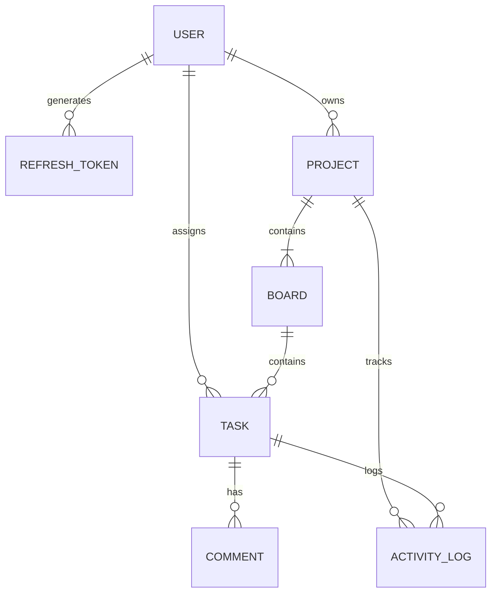

# Architecture & System Design Documentation

## 1. Executive Overview

**PulseFlow** is an enterprise-grade, full-stack Project Management and Collaboration platform architected with a decoupled Client-Server model. It features real-time Kanban workflow management, hierarchical Role-Based Access Control (RBAC), short-lived JWT authentication with automatic Refresh Token rotation, and structured audit trail logging.

```
┌─────────────────────────────────────────────────────────────┐
│                    React Client (Vite)                      │
│   Kanban Boards │ Task Modals │ Filters │ Activity Stream   │
└──────────────────────────────┬──────────────────────────────┘
                               │ HTTPS / JSON (REST)
                               ▼
┌─────────────────────────────────────────────────────────────┐
│                   Express.js REST API Layer                 │
│  ├── Helmet / CORS / Rate Limiting Security Middleware      │
│  ├── JWT Authentication & Refresh Token Interceptor        │
│  ├── Role-Based Access Control (RBAC) Guard                 │
│  ├── Joi Schema Input Validation                            │
│  └── Centralized Error & Exception Handler                  │
└──────────────────────────────┬──────────────────────────────┘
                               │ Mongoose ODM
                               ▼
┌─────────────────────────────────────────────────────────────┐
│                   MongoDB Document Database                 │
│  ├── Users & Refresh Tokens (with TTL Indexes)              │
│  ├── Projects, Members & Custom Boards                      │
│  ├── Tasks, Subtasks & Checklists                           │
│  └── Comments & Activity Audit Logs                         │
└─────────────────────────────────────────────────────────────┘
```

---

## 2. Key Architecture Decisions

### 2.1 Layered MVC & Clean Route Architecture
The backend is structured into distinct, decoupled tiers:
- **Routes Layer (`src/routes`)**: Declarative endpoint definitions with chained middleware (auth, RBAC, input validation).
- **Controllers Layer (`src/controllers`)**: Business logic orchestrators enforcing domain rules, transaction consistency, and activity auditing.
- **Data Access & Models Layer (`src/models`)**: Mongoose schema declarations with embedded sub-documents (e.g., subtasks, members), schema methods, pre-save cryptographic hooks, and compound indexes.
- **Middleware Layer (`src/middleware`)**: Cross-cutting concerns including token authentication, RBAC authorization, schema validation, and centralized exception catching.

### 2.2 Dual-Token JWT Authentication & Refresh Token Rotation
To combine zero-latency stateless verification with immediate session revocation capabilities:
- **Access Tokens (`15m` expiry)**: Embedded with user ID, name, email, and system role. Verified locally in middleware with minimal overhead.
- **Refresh Tokens (`7d` expiry)**: Stored in the database with automatic TTL expiration (`expiresAt` index).
- **Refresh Token Rotation (RTR)**: When an access token expires, the client sends the refresh token to `/api/v1/auth/refresh`. The server invalidates the old refresh token, issues a brand-new access token + refresh token pair, preventing replay attacks.
- **Axios Silent Refresh**: The frontend Axios client intercepts `401 Unauthorized` responses, queues pending requests, requests a fresh token pair, and seamlessly retries without interrupting user interaction.

### 2.3 Role-Based Access Control (RBAC)
PulseFlow enforces a dual-tier permission hierarchy:

#### Global / System Roles
1. **System Admin (`admin`)**: Global superuser capable of inspecting all workspaces, projects, and auditing system telemetry.
2. **Standard User (`user`)**: Base account type with access restricted to explicitly owned or joined projects.

#### Project-Scoped Permissions
| Action | Owner | Admin | Member | Viewer |
|---|:---:|:---:|:---:|:---:|
| View Project & Boards | ✅ | ✅ | ✅ | ✅ |
| View Tasks & Comments | ✅ | ✅ | ✅ | ✅ |
| Create / Edit Tasks | ✅ | ✅ | ✅ | ❌ |
| Move Tasks (Kanban DND) | ✅ | ✅ | ✅ | ❌ |
| Add / Delete Comments | ✅ | ✅ | ✅ (Own) | ❌ |
| Create / Edit Boards | ✅ | ✅ | ❌ | ❌ |
| Invite / Manage Members | ✅ | ✅ | ❌ | ❌ |
| Change Member Roles | ✅ | ✅ | ❌ | ❌ |
| Change Project Status (Complete / Archive) | ✅ | ✅ | ❌ | ❌ |
| Delete Project | ✅ | ✅ | ❌ | ❌ |

---

## 3. Database Schema Design & Relationships



### Schema Details:
- **`User`**: `_id`, `name`, `email` (unique index), `password` (bcrypt hashed), `avatar`, `role`, `isActive`, timestamps.
- **`RefreshToken`**: `token`, `user` (ref User), `expiresAt` (TTL index), `isRevoked`, timestamps.
- **`Project`**: `name`, `key`, `description`, `color`, `owner` (ref User), `members: [{ user, role, joinedAt }]`, `status`, timestamps.
- **`Board`**: `name`, `description`, `project` (ref Project), `columns: [{ id, name, key, color, order }]`, `isDefault`, timestamps.
- **`Task`**: `title`, `description`, `project`, `board`, `status` ('todo' | 'in-progress' | 'review' | 'done'), `priority` ('low' | 'medium' | 'high' | 'urgent'), `dueDate`, `assignees: [ref User]`, `tags: [String]`, `subtasks: [{ title, completed }]`, `order`, timestamps.
- **`Comment`**: `task` (ref Task), `project` (ref Project), `user` (ref User), `content`, `mentions: [ref User]`, `isEdited`, timestamps.
- **`ActivityLog`**: `project`, `board`, `task`, `user`, `action`, `details`, `meta`, `timestamp`.

---

## 4. API Standardization & Centralized Error Handling

### 4.1 Uniform Success Response Structure
```json
{
  "success": true,
  "message": "Operation completed successfully",
  "data": { ... },
  "meta": {
    "page": 1,
    "limit": 20,
    "totalItems": 45,
    "totalPages": 3,
    "hasMore": true
  }
}
```

### 4.2 Uniform Error Response Structure
```json
{
  "success": false,
  "message": "Validation failed",
  "errors": [
    { "field": "email", "message": "Please enter a valid email address" }
  ]
}
```

All controller errors are caught by express next handlers and routed to `errorMiddleware.js`, which normalizes MongoDB duplicate key errors (11000), Mongoose validation errors, and custom `ApiError` instances into clean JSON payloads with appropriate HTTP status codes (200, 201, 400, 401, 403, 404, 409, 500).
